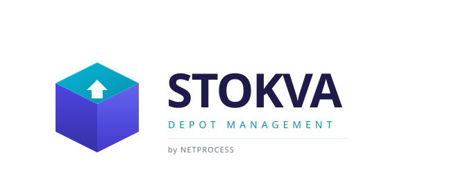

<div align="center">



# Gestion des Dépôts de Stockage

**Application web pour le suivi complet de vos opérations de dépôt.**

[](https://github.com/mednabet/stokva/releases)
[](LICENSE)
[]()
[](https://github.com/mednabet)

[Installation rapide](#-installation-rapide-windows) · [Fonctionnalités](#-fonctionnalités) · [Démo en ligne](https://mednabet.github.io/stokva/) · [Charte graphique](assets/brand/BRAND-GUIDELINES.md) · [Migration v1→v2](MIGRATION.md)

</div>

---

## 🆕 Version 2.0 — Backend multi-utilisateurs

> STOKVA peut désormais fonctionner en **mode multi-utilisateurs avec backend PostgreSQL** (dossier [`backend/`](backend/)).
> Le mode v1 (localStorage standalone) reste **entièrement supporté** — la v2 est additive.

### En un coup d'œil

| Mode | Stockage | Multi-utilisateurs | Pont-bascule série | Audit |
|------|----------|--------------------|--------------------|-------|
| **v1** (mode standalone) | localStorage navigateur | ❌ | ⚠️ via simulation | ❌ |
| **v2** (mode backend) | PostgreSQL | ✅ + WebSocket | ✅ RS232/USB | ✅ complet |

### Démarrer la v2

```cmd
cd backend
install-windows.bat
```

L'installer **détecte et installe automatiquement** Node.js, PostgreSQL et NSSM si absents (via `winget` ou téléchargement direct depuis les sites officiels). Aucun prérequis manuel — il vous suffit d'accepter l'UAC et d'attendre 5-10 min.

Voir [`backend/README.md`](backend/README.md) pour la documentation complète, et [`MIGRATION.md`](MIGRATION.md) pour le guide de migration.

---

## 🚀 Installation rapide (Windows)

### Méthode 1 — Installation automatique (recommandée)

1. **Téléchargez** le projet (bouton vert `Code` → `Download ZIP`) ou clonez :
   ```cmd
   git clone https://github.com/mednabet/stokva.git
   ```

2. **Double-cliquez** sur `install-windows.bat` (clic droit → *Exécuter en tant qu'administrateur* recommandé).

3. Le script va :
   - ✅ Vérifier la présence d'un navigateur compatible
   - ✅ Créer un raccourci sur le Bureau
   - ✅ Optionnellement installer un serveur Python local
   - ✅ Lancer l'application

### Méthode 2 — Lancement direct (sans installation)

Double-cliquez simplement sur **`index.html`** : l'application s'ouvre dans votre navigateur. C'est tout.

> 💡 **Identifiants par défaut** : `admin` / `admin`

---

## ✨ Fonctionnalités

### 📦 Opérations
- **Réceptions** — Bons de réception (BR) numérotés automatiquement, liaison fournisseurs, chauffeurs, matricules
- **Expéditions** — Bons de livraison (BL) avec destinations chantiers et clients
- **Pont-bascule** — Capture poids brut/tare/net, modes simulation / manuel / liaison série
- **Tableau de bord** — KPIs en temps réel, graphiques, alertes stock

### 🏭 Catalogue
- **Multi-dépôts** avec capacité et responsable
- **Articles** avec stock minimum et alertes automatiques
- **Partenaires** (fournisseur / client / mixte)
- **Véhicules** avec tare et chauffeur associé

### 📊 Rapports & Exports
- Registre mensuel style **G0** (conforme EN 07-O04)
- Statistiques par période / partenaire / article / véhicule
- Journal des pesées
- Export **Excel** et **PDF** avec en-tête société
- Impression directe des bons

### 🔐 Administration
- 4 rôles configurables (Admin / Responsable / Opérateur / Consultation)
- Paramètres société (logo, ICE, RC, IF, CNSS)
- **Sauvegarde / restauration JSON** complète
- Mode clair / sombre
- Interface 100% responsive

---

## 🎨 Identité visuelle

STOKVA propose une charte graphique moderne avec une palette **indigo profond + cyan électrique** :

| Couleur | Hex | Rôle |
|---------|-----|------|
| 🟪 Indigo profond | `#312E81` | Couleur principale |
| 🟦 Cyan électrique | `#06B6D4` | Accent et actions |
| 🟣 Violet vibrant | `#6366F1` | Éléments secondaires |

📖 **[Voir la charte complète →](assets/brand/BRAND-GUIDELINES.md)**

---

## 🖥️ Configuration requise

| Composant | Minimum | Recommandé |
|-----------|---------|------------|
| Système | Windows 7 SP1+ | Windows 10/11 |
| Navigateur | Chrome 90+, Firefox 88+, Edge 90+ | Chrome dernière version |
| RAM | 2 Go | 4 Go |
| Espace disque | 10 Mo | 50 Mo |
| Connexion | Aucune (offline) | Aucune |

> ⚠️ **Internet Explorer n'est pas supporté.**

---

## 📁 Structure du projet

```
stokva/
├── index.html                  # Page principale
├── manifest.webmanifest        # PWA manifest
├── install-windows.bat         # Installateur Windows
├── start-stokva.bat            # Lanceur rapide
├── start-server.bat            # Lanceur avec serveur Python
├── reset-data.bat              # Guide de réinitialisation
├── assets/
│   ├── icons/                  # Favicons et icônes (SVG, PNG, ICO)
│   ├── logos/                  # Logos (SVG + PNG)
│   └── brand/                  # Charte graphique
├── css/
│   ├── style.css               # Styles principaux + design tokens
│   └── style-extras.css        # Styles complémentaires + branding
├── js/
│   ├── app.js                  # Contrôleur principal
│   ├── auth.js                 # Authentification & permissions
│   ├── storage.js              # Persistance localStorage
│   ├── utils.js                # Utilitaires (exports, formatage)
│   ├── components.js           # Composants UI réutilisables
│   ├── components-extras.js    # Wrappers de compatibilité
│   └── pages/                  # 11 modules
└── static/description/         # Page de présentation
```

---

## 💾 Sauvegarde & Sécurité

⚠️ **Les données sont stockées dans le `localStorage` de votre navigateur** (clé `stokva_db_v1`).

### Effectuer une sauvegarde
1. Connectez-vous en tant qu'**administrateur**
2. Menu → **Paramètres** → onglet **Sauvegarde**
3. Cliquez sur **Exporter** → un fichier JSON est téléchargé
4. **Conservez-le dans un endroit sûr** (cloud, disque externe)

### Bonnes pratiques
- ✅ Sauvegarde **quotidienne** en production
- ✅ Conservez plusieurs versions (rotation 7 / 30 / 90 jours)
- ⚠️ Vider le cache du navigateur supprime toutes les données
- ⚠️ Le mode "navigation privée" ne conserve aucune donnée

---

## 🎯 Première utilisation

1. **Connectez-vous** avec `admin` / `admin`
2. ⚙️ **Paramètres → Société** : renseignez nom, adresse, ICE, etc.
3. 🔐 **Créez un nouveau compte admin** avec un mot de passe fort
4. 🗑️ Désactivez le compte `admin` par défaut
5. 🏭 **Dépôts** → créez vos dépôts réels
6. 📦 **Stock & Articles** → ajoutez votre catalogue
7. 🤝 **Partenaires** et **Véhicules** → renseignez les vôtres
8. ✅ Vous pouvez commencer à saisir vos opérations !

---

## 🔧 Lancement avancé

### Via serveur local (Python)
```cmd
start-server.bat
```
L'application sera accessible sur `http://localhost:8080`

### Personnalisation
- **Logo société** : Paramètres → Société (logo personnalisé)
- **Devise** : MAD (par défaut), EUR, USD, GBP
- **Préfixes** : BR, BL, PB modifiables dans Paramètres → Documents

---

## 🐛 Dépannage

| Problème | Solution |
|----------|----------|
| L'application ne s'ouvre pas | Vérifiez que vous avez Chrome/Firefox/Edge |
| Données perdues | Importez votre dernière sauvegarde JSON |
| "Identifiants incorrects" | Vérifiez majuscules/minuscules |
| Réinitialisation totale | Paramètres → Sauvegarde → Réinitialiser |

---

## 📄 Licence

MIT License — voir [LICENSE](LICENSE)

## 👥 À propos

**STOKVA** est une marque déposée de **NETPROCESS**.

> *Stokva* — étymologie : fusion de *Stock* (inventaire) + *Va* (mouvement, action). L'inventaire en mouvement.

---

<div align="center">

**© 2026 STOKVA · by NETPROCESS · Tous droits réservés**

[Documentation](assets/brand/BRAND-GUIDELINES.md) · [Issues](../../issues) · [Releases](../../releases)

</div>
